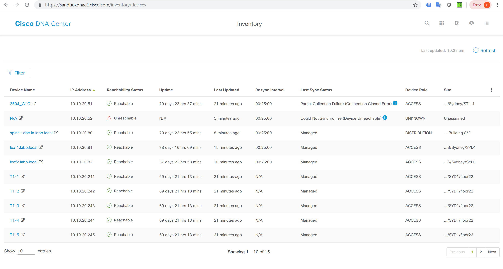

# DNAC inventory to putty

This Python script connects to a Cisco DNA Center server via the API, queries the inventory
and then adds the hostname/ip as SSH sessions in [Putty](https://www.putty.org/) for all devices on the users machine. **Windows only**

## DevNet Code Exchange

This repository is featured on Cisco DevNet Code Exchange.

[](https://developer.cisco.com/codeexchange/github/repo/Natilik/dna-putty-sessions)

## DNAC inventory



## Putty Sessions


## Getting Started

This script is using the Cisco Devnet DNAC sandbox always on lab. You can connect to the GUI and view the documentation [on the devnet sandbox site](https://devnetsandbox.cisco.com/RM/Diagram/Index/471eb739-323e-4805-b2a6-d0ec813dc8fc?diagramType=Topology).

If using your own DNAC, you will need to enable the API package via the "Platform", section in DNA Center, documentation can be found [on the Cisco developer site](https://developer.cisco.com/docs/dna-center/#!cisco-dna-center-platform-overview).

### Running the code

- Clone the repo:  
`git clone https://gitlab.com/natilik/networking/dna-putty-sessions.git`
- Modify `username`, `password` and `hostname` in the `dna_devices_to_putty.py` file to connect to your preferred DNAC server.  **Note: [Platform API package must be running](https://developer.cisco.com/docs/dna-center/#!cisco-dna-center-platform-overview)** *(tested on 1.2.10)*
- At the command line:

```cmd
C:\> cd dna-putty-sessions
C:\dna-putty-sessions> python -m venv venv
C:\dna-putty-sessions> venv\Scripts\activate
(venv) C:\dna-putty-sessions> pip install -r requirements.txt
(venv) C:\dna-putty-sessions> python dna_devices_to_putty.py
```

### Prerequisites

* [Python 3.7.1](https://www.python.org/)
* [Putty](https://www.putty.org/)
* `dnacmodule.py` included in repo
* `requirements.txt` included in repo:

```requirements.txt
Jinja2==2.10.1
requests==2.21.0
urllib3==1.24.2
xlrd==1.2.0
xlwt==1.3.0
```

## To do

- Expand to support other SSH applications e.g. SecureCRT

## Authors

* **Chris Salisbury** - *Initial work* - [nonstdout](https://gitlab.com/nonstdout)

## Licence

This project is licensed under the GNU GPLv3 Licence - see the [Licence.md](licence.md) and [Notice.md](notice.md) file for details
